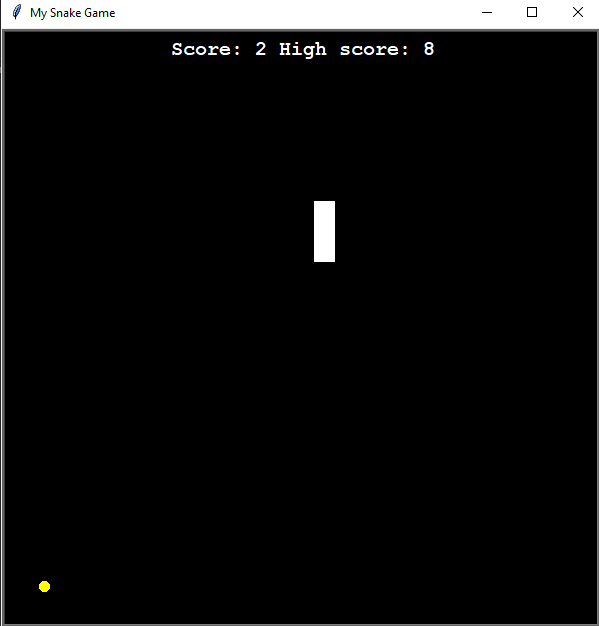

# My Snake Game

This project is a classic Snake game implemented using Python's `turtle` graphics library. The game involves controlling a snake to eat food, grow in size, and avoid collisions with the walls or itself.

## Features

- **Snake Movement**: Control the snake using the arrow keys.
- **Food Consumption**: The snake grows in size when it eats food.
- **Score Tracking**: The game keeps track of the player's score.
- **Game Pause**: Pause the game by pressing the 'p' key.
- **Collision Detection**: The game detects collisions with walls and the snake's own body.

## Installation

1. **Clone the repository**:
    ```sh
    git clone https://github.com/yourusername/snake-game.git
    cd snake-game
    ```

2. **Install dependencies**:
    Ensure you have Python installed. This project uses the `turtle` module, which is included in the Python Standard Library.

## Usage

1. **Run the game**:
    ```sh
    python main.py
    ```

2. **Controls**:
    - **Up Arrow**: Move the snake up
    - **Down Arrow**: Move the snake down
    - **Left Arrow**: Move the snake left
    - **Right Arrow**: Move the snake right
    - **'p' Key**: Pause the game

## Project Structure

- `main.py`: The main script to run the game.
- `snake.py`: Contains the `Snake` class which handles the snake's behavior.
- `food.py`: Contains the `Food` class which handles the food's behavior.
- `score_board.py`: Contains the `ScoreBoard` class which handles the score display.

## Classes

### Snake

Handles the creation, movement, and growth of the snake.

### Food

Handles the creation and repositioning of the food.

### ScoreBoard

Handles the display and updating of the score.

## Acknowledgements

- Python `turtle` graphics library for providing the tools to create the game.
- Various online resources and tutorials for inspiration and guidance.
## Screenshot

Here's a preview of the Snake App:



## Contributing

Feel free to submit issues or pull requests. Contributions are welcome!

## License

This project is licensed under the MIT License. See the [LICENSE.txt](docs/LICENSE.txt) file for details.
